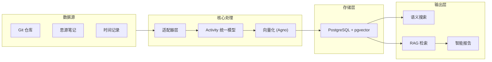

# TraceWeaver

> 个人数据管理与知识库构建平台 - 让碎片化的工作痕迹成为可检索、可理解的个人知识资产

## 项目愿景

**TraceWeaver** 的目标是管理个人的所有数据，为其构建一个大的知识库。通过自动化收集、标准化和智能分析个人在不同平台（代码、笔记、时间记录等）上的活动，帮助用户：

- 📚 **构建个人知识库**：将碎片化数据统一管理，形成可检索的知识体系
- 🔍 **语义搜索**：根据意图而非关键词检索历史活动
- 🤖 **智能问答**：基于个人数据的 AI 助手（RAG 增强）
- 📊 **自动化报告**：生成工作日报、周报等结构化总结

## 核心理念

### Trace as a Stream（痕迹即流）

无论数据来自代码提交、时间记录软件还是笔记工具，都应被标准化为统一的"活动事件 (Activity Event)"。这种统一抽象确保：

- 核心业务逻辑与数据源解耦
- 添加新数据源只需实现适配器接口
- 所有数据可统一查询、分析和向量化

### Knowledge as Context（知识即上下文）

通过 **RAG（检索增强生成）** 技术，将个人数据转化为 LLM 可用的上下文：

```
数据 → 向量化 → pgvector 存储 → 语义搜索 → LLM 上下文 → 智能输出
```

这使得：
- 可以根据意图而非关键词搜索历史记录
- LLM 基于个人数据生成更准确的报告
- 构建真正的"个人 AI 助手"

## 核心特性

- 🔌 **多数据源支持**：通过适配器模式支持 Git、Dayflow、SiYuan 等多种数据源
- 🎯 **统一数据模型**：所有数据源统一转换为标准化的活动事件
- 🔍 **语义搜索**：基于向量的语义搜索，根据意图而非关键词查找内容
- 🧠 **RAG 增强**：检索增强生成，为 LLM 提供个人数据上下文
- 🤖 **AI 智能总结**：基于 LLM 自动生成工作日报和周报
- 📊 **可视化时间线**：直观展示一天的活动流
- ✏️ **可编辑报告**：支持手动修正和优化 AI 生成的内容
- 🔒 **安全可靠**：JWT 认证、密码加密、数据隔离
- 🚀 **现代化技术栈**：FastAPI + React + TypeScript + PostgreSQL + pgvector

## 技术栈

### 后端
- **FastAPI** - 高性能 Python Web 框架
- **SQLModel** - 基于 Pydantic 和 SQLAlchemy 的 ORM（同步模式）
- **PostgreSQL + pgvector** - 关系型数据库 + 向量存储扩展
- **Agno** - 可扩展的 Embedder 抽象框架
- **Alembic** - 数据库迁移工具
- **Pydantic v2** - 数据验证和设置管理
- **Loguru** - 日志记录框架

### 前端
- **React 18** - UI 框架
- **TypeScript** - 类型安全
- **Vite** - 构建工具
- **TanStack Router** - 类型安全路由
- **TanStack Query** - 数据获取和状态管理
- **Tailwind CSS** - 样式框架
- **shadcn/ui** - UI 组件库
- **pnpm** - 包管理工具

### 基础设施
- **Docker Compose** - 容器编排
- **Traefik** - 反向代理和负载均衡
- **Playwright** - 端到端测试

## 快速开始

### 前置要求

- [Docker](https://www.docker.com/) 和 Docker Compose
- [uv](https://docs.astral.sh/uv/) (Python 包管理工具，可选)

### 启动项目

1. **克隆仓库**

```bash
git clone <repository-url>
cd TraceWeaver
```

2. **配置环境变量**

复制 `.env.example` 为 `.env` 并配置必要的环境变量（如果存在）。

3. **启动 Docker Compose 服务**

```bash
docker compose watch
```

4. **访问应用**

- 前端界面: http://localhost:5173
- 后端 API: http://localhost:8000
- API 文档 (Swagger): http://localhost:8000/docs
- 数据库管理 (Adminer): http://localhost:8080

### 本地开发

详细的开发指南请参考 [开发文档](development.md)。

## 系统架构

TraceWeaver 采用 **Hexagonal Architecture（六边形架构/端口适配器模式）**，核心业务逻辑与外部系统完全解耦。



详细的架构设计请参考 [架构文档](docs/ARCHITECTURE.md)。

## 核心概念

### 统一活动模型 (Unified Activity Model)

所有数据源的数据都被转换为统一的活动事件格式，存储在 `activities` 表中：

| 字段名 | 类型 | 说明 | 示例 |
|--------|------|------|------|
| `id` | UUID | 主键 | - |
| `user_id` | UUID | 用户ID | - |
| `source_type` | String | 数据源类型 | "git", "dayflow", "siyuan" |
| `source_id` | String | 来源方的唯一ID | Git Hash 或 UUID |
| `occurred_at` | DateTime | 发生时间 | 2023-10-27 14:30:00 |
| `title` | String | 简短描述 | "fix: payment logic" |
| `content` | Text | 详细内容/上下文 | Commit Diff, 笔记正文 |
| `metadata` | JSONB | 源特有数据 | `{"repo": "backend", "branch": "main"}` |
| `fingerprint` | String | 哈希指纹 | 用于防止重复导入 |

### 适配器模式 (Adapter Pattern)

通过 `BaseConnector` 接口定义统一的数据源接入规范，每个数据源实现自己的适配器：

- **Git Connector**: 从本地 Git 仓库读取提交记录（支持批量扫描）
- **Dayflow Connector**: 解析时间记录数据（CSV/API）
- **SiYuan Connector**: 从思源笔记获取笔记内容

这种设计使得添加新数据源变得非常简单，只需实现 `BaseConnector` 接口即可。详见 [数据源接入指南](docs/DATA_SOURCE_GUIDE.md)。

### RAG 与向量存储

TraceWeaver 使用 **[Agno 框架](https://docs.agno.com)** 实现可扩展的文本向量化：

- **统一接口**：支持 OpenAI、Ollama、HuggingFace 等多种 Embedder
- **灵活切换**：开发环境用本地模型，生产环境用云端 API
- **语义搜索**：基于 pgvector 的向量相似性搜索
- **RAG 增强**：为 LLM 提供相关的个人数据上下文

## 项目结构

```
TraceWeaver/
├── backend/                 # 后端服务
│   ├── app/
│   │   ├── api/            # API 路由层
│   │   ├── core/           # 核心配置
│   │   ├── models/         # SQLModel 数据模型
│   │   ├── schemas/        # Pydantic 模型 (DTOs)
│   │   ├── services/       # 业务逻辑层
│   │   └── connectors/     # 数据源适配器层
│   ├── alembic/            # 数据库迁移
│   └── tests/              # 测试代码
├── frontend/                # 前端应用
│   ├── src/
│   │   ├── components/     # React 组件
│   │   ├── hooks/          # 自定义 Hooks
│   │   ├── routes/         # 路由定义
│   │   └── services/       # API 客户端
│   └── tests/              # E2E 测试
├── docs/                    # 项目文档
│   ├── ARCHITECTURE.md     # 架构设计文档
│   ├── DATA_SOURCE_GUIDE.md  # 数据源接入指南
│   └── API_CONVENTIONS.md  # API 设计规范
├── .cursor/rules/          # AI 开发规则
│   ├── project-context.mdc # 项目引导
│   ├── backend.mdc         # 后端开发规范
│   ├── frontend.mdc        # 前端开发规范
│   ├── database.mdc        # 数据库规范
│   └── embedding.mdc       # 向量化规范
├── docker-compose.yml       # Docker Compose 配置
└── README.md               # 本文件
```

## 核心业务流程

### 1. 数据同步与向量化

```
数据源 → 适配器 → Activity 对象 → 数据库存储
                ↓
         文本分块 → Agno Embedder → 向量存储（pgvector）
```

1. 用户触发同步操作
2. 适配器从外部系统抓取数据
3. 转换为统一的 `Activity` 模型
4. 指纹去重后存入数据库
5. 异步进行文本向量化

### 2. 语义搜索与 RAG

```
用户查询 → 向量化 → 相似性搜索 → Top-K 结果
                                    ↓
            LLM 生成 ← Prompt 构建 ← 上下文注入
```

1. 用户输入查询或请求生成报告
2. 查询文本通过 Embedder 向量化
3. pgvector 执行向量相似性搜索
4. 检索相关的 Top-K 片段
5. 构建包含上下文的 Prompt
6. 调用 LLM API 生成结果

### 3. 报告生成与编辑

1. LLM 基于 RAG 上下文生成 Markdown 报告
2. 前端展示可编辑的 Markdown 编辑器
3. 用户可以手动修正和优化内容
4. 保存最终报告

## 文档

### 核心文档
- 📖 [架构设计文档](docs/ARCHITECTURE.md) - 详细的系统架构和设计说明（含 RAG 设计）
- 🔌 [数据源接入指南](docs/DATA_SOURCE_GUIDE.md) - 如何添加新的数据源
- 🌐 [API 设计规范](docs/API_CONVENTIONS.md) - RESTful API 约定和最佳实践

### 开发规范（Cursor Rules）
- 📋 [项目引导](.cursor/rules/project-context.mdc) - 项目定位和核心理念
- 🔧 [后端开发规范](.cursor/rules/backend.mdc) - ORM、类型注解、日志等规范
- 🎨 [前端开发规范](.cursor/rules/frontend.mdc) - React、TypeScript、TanStack 等规范
- 🗄️ [数据库规范](.cursor/rules/database.mdc) - Alembic 迁移和模型设计规范
- 🧠 [向量化规范](.cursor/rules/embedding.mdc) - Agno 框架使用规范

### 其他文档
- 🚀 [开发指南](development.md) - 本地开发环境设置和开发流程
- 🌍 [部署指南](deployment.md) - 生产环境部署说明

## 开发指南

### 技术要求

- **Python 3.12+** - 后端开发
- **Node.js 18+** - 前端开发
- **pnpm** - 前端包管理
- **PostgreSQL 14+** - 数据库（需启用 pgvector 扩展）

### 开发规范

项目遵循以下关键规范：

- ✅ **ORM 使用同步方式**（Session，非 AsyncSession）
- ✅ **类型注解使用 `Optional[T]`** 而非 `T | None`
- ✅ **Alembic 迁移手动生成**，AI 只做提醒
- ✅ **使用 loguru 记录日志**
- ✅ **复杂参数封装为 Pydantic Schema**
- ✅ **前端使用 pnpm 安装包**

详见 [Cursor Rules](.cursor/rules/) 目录下的各项规范。

### 添加新的数据源

1. 在 `backend/app/connectors/impl/` 创建新的连接器类
2. 实现 `BaseConnector` 接口的两个方法：
   - `validate_config()`: 验证配置有效性
   - `fetch_activities()`: 抓取数据并转换为 `ActivityCreate` 对象
3. 在 `connectors/registry.py` 中注册新连接器
4. 添加前端配置表单组件

详细步骤请参考 [数据源接入指南](docs/DATA_SOURCE_GUIDE.md)。

### 运行测试

```bash
# 后端测试
cd backend
bash scripts/test.sh

# 前端 E2E 测试
cd frontend
npx playwright test
```

### 代码格式化

后端使用 `prek` 进行代码格式化和检查：

```bash
cd backend
uv run prek run --all-files
```

前端使用 `biome` 进行代码格式化：

```bash
cd frontend
pnpm run format
```

### 生成 Alembic 迁移脚本

当修改数据库模型后，**手动**执行以下命令生成迁移脚本：

```bash
cd backend
alembic revision --autogenerate -m "描述性的迁移说明"
```

⚠️ **重要**：生成后必须人工审核迁移脚本，确认无误后再执行：

```bash
alembic upgrade head
```

## 贡献指南

欢迎贡献代码！请遵循以下步骤：

1. Fork 本仓库
2. 创建特性分支 (`git checkout -b feature/AmazingFeature`)
3. 提交更改 (`git commit -m 'Add some AmazingFeature'`)
4. 推送到分支 (`git push origin feature/AmazingFeature`)
5. 开启 Pull Request

## 许可证

本项目采用 [LICENSE](LICENSE) 许可证。

## 相关链接

### 后端框架
- [FastAPI 文档](https://fastapi.tiangolo.com/)
- [SQLModel 文档](https://sqlmodel.tiangolo.com/)
- [Pydantic 文档](https://docs.pydantic.dev/)
- [Agno 文档](https://docs.agno.com/)

### 前端框架
- [React 文档](https://react.dev/)
- [TanStack Router](https://tanstack.com/router)
- [TanStack Query](https://tanstack.com/query)
- [shadcn/ui](https://ui.shadcn.com/)

### 数据库
- [PostgreSQL 文档](https://www.postgresql.org/docs/)
- [pgvector 文档](https://github.com/pgvector/pgvector)

---

**TraceWeaver** - 让工作痕迹自动编织成有价值的报告 ✨
