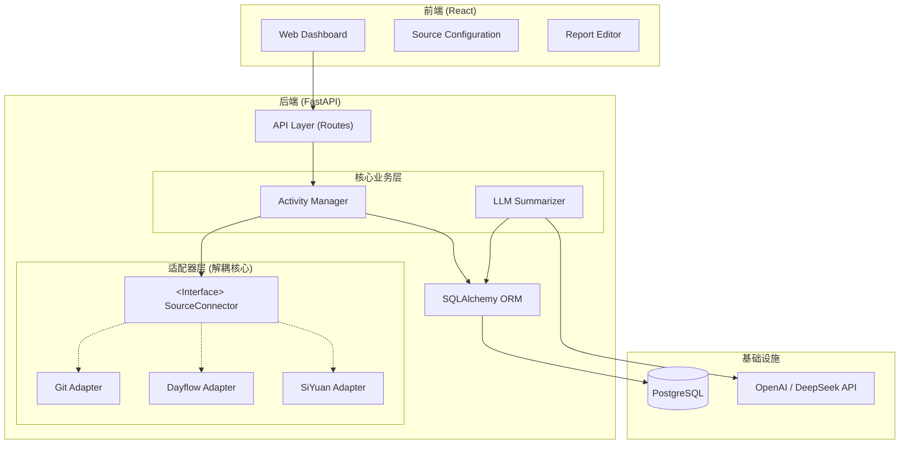

# TraceWeaver

> 自动化的工作痕迹编织平台 - 将碎片化的元数据转化为高价值的结构化报告

## 项目愿景

**TraceWeaver** 是一个自动化的工作痕迹编织平台，旨在解放开发者的总结时间，通过 AI 将碎片化的元数据转化为高价值的结构化报告。

### 核心理念：Trace as a Stream（痕迹即流）

无论数据来自代码提交、时间记录软件还是笔记工具，都应被标准化为统一的"活动事件 (Activity Event)"。这种统一抽象使得系统能够灵活接入各种数据源，同时保持核心业务逻辑的简洁和可维护。

## 核心特性

- 🔌 **多数据源支持**：通过适配器模式支持 Git、Dayflow、SiYuan 等多种数据源
- 🎯 **统一数据模型**：所有数据源统一转换为标准化的活动事件
- 🤖 **AI 智能总结**：基于 LLM 自动生成工作日报和周报
- 📊 **可视化时间线**：直观展示一天的活动流
- ✏️ **可编辑报告**：支持手动修正和优化 AI 生成的内容
- 🔒 **安全可靠**：JWT 认证、密码加密、数据隔离
- 🚀 **现代化技术栈**：FastAPI + React + TypeScript + PostgreSQL

## 技术栈

### 后端
- **FastAPI** - 高性能 Python Web 框架
- **SQLModel** - 基于 Pydantic 和 SQLAlchemy 的 ORM
- **PostgreSQL** - 关系型数据库
- **Alembic** - 数据库迁移工具
- **Pydantic v2** - 数据验证和设置管理

### 前端
- **React** - UI 框架
- **TypeScript** - 类型安全
- **Vite** - 构建工具
- **TanStack Router** - 路由管理
- **TanStack Query** - 数据获取和状态管理
- **Tailwind CSS** - 样式框架
- **shadcn/ui** - UI 组件库

### 基础设施
- **Docker Compose** - 容器编排
- **Traefik** - 反向代理和负载均衡
- **Playwright** - 端到端测试

## 快速开始

### 前置要求

- [Docker](https://www.docker.com/) 和 Docker Compose
- [uv](https://docs.astral.sh/uv/) (Python 包管理工具，可选)

### 启动项目

1. **克隆仓库**

```bash
git clone <repository-url>
cd TraceWeaver
```

2. **配置环境变量**

复制 `.env.example` 为 `.env` 并配置必要的环境变量（如果存在）。

3. **启动 Docker Compose 服务**

```bash
docker compose watch
```

4. **访问应用**

- 前端界面: http://localhost:5173
- 后端 API: http://localhost:8000
- API 文档 (Swagger): http://localhost:8000/docs
- 数据库管理 (Adminer): http://localhost:8080

### 本地开发

详细的开发指南请参考 [开发文档](development.md)。

## 系统架构

TraceWeaver 采用 **Hexagonal Architecture（六边形架构/端口适配器模式）**，核心业务逻辑与外部系统完全解耦。



## 核心概念

### 统一活动模型 (Unified Activity Model)

所有数据源的数据都被转换为统一的活动事件格式，存储在 `activities` 表中：

| 字段名 | 类型 | 说明 | 示例 |
|--------|------|------|------|
| `id` | UUID | 主键 | - |
| `user_id` | UUID | 用户ID | - |
| `source_type` | String | 数据源类型 | "git", "dayflow", "siyuan" |
| `source_id` | String | 来源方的唯一ID | Git Hash 或 UUID |
| `occurred_at` | DateTime | 发生时间 | 2023-10-27 14:30:00 |
| `title` | String | 简短描述 | "fix: payment logic" |
| `content` | Text | 详细内容/上下文 | Commit Diff, 笔记正文 |
| `metadata` | JSONB | 源特有数据 | `{"repo": "backend", "branch": "main"}` |
| `fingerprint` | String | 哈希指纹 | 用于防止重复导入 |

### 适配器模式 (Adapter Pattern)

通过 `BaseConnector` 接口定义统一的数据源接入规范，每个数据源实现自己的适配器：

- **Git Connector**: 从本地 Git 仓库读取提交记录
- **Dayflow Connector**: 解析时间记录数据（CSV/API）
- **SiYuan Connector**: 从思源笔记获取笔记内容

这种设计使得添加新数据源变得非常简单，只需实现 `BaseConnector` 接口即可。

## 项目结构

```
TraceWeaver/
├── backend/                 # 后端服务
│   ├── app/
│   │   ├── api/            # API 路由层
│   │   ├── core/           # 核心配置
│   │   ├── models/         # SQLModel 数据模型
│   │   ├── schemas/        # Pydantic 模型 (DTOs)
│   │   ├── services/       # 业务逻辑层
│   │   └── connectors/     # 数据源适配器层
│   ├── alembic/            # 数据库迁移
│   └── tests/              # 测试代码
├── frontend/                # 前端应用
│   ├── src/
│   │   ├── components/     # React 组件
│   │   ├── hooks/          # 自定义 Hooks
│   │   ├── routes/         # 路由定义
│   │   └── services/       # API 客户端
│   └── tests/              # E2E 测试
├── docs/                    # 项目文档
│   └── ARCHITECTURE.md     # 架构设计文档
├── docker-compose.yml       # Docker Compose 配置
└── README.md               # 本文件
```

## 核心业务流程

### 1. 同步 (Sync)

1. 用户在前端点击"同步今日数据"
2. 后端遍历用户配置的所有数据源
3. 通过适配器工厂找到对应的 Connector
4. Connector 抓取数据并转换为 `Activity` 对象
5. 服务层进行指纹去重 (UPSERT)，存入数据库

### 2. 生成 (Generate)

1. 用户点击"生成日报/周报"
2. 后端从数据库拉取指定时间范围内的所有活动
3. 构建 Prompt，调用 LLM API
4. LLM 返回 Markdown 格式的报告
5. 存入 `reports` 表

### 3. 反馈与迭代 (Refine)

1. 前端展示 Markdown 编辑器
2. 用户可以手动修改 AI 生成的内容
3. 保存修改后的报告

## 文档

- [架构设计文档](docs/ARCHITECTURE.md) - 详细的系统架构和设计说明
- [开发指南](development.md) - 本地开发环境设置和开发流程
- [部署指南](deployment.md) - 生产环境部署说明
- [后端文档](backend/README.md) - 后端开发详细说明
- [前端文档](frontend/README.md) - 前端开发详细说明

## 开发指南

### 添加新的数据源

1. 在 `backend/app/connectors/impl/` 创建新的连接器类
2. 实现 `BaseConnector` 接口的两个方法：
   - `validate_config()`: 验证配置有效性
   - `fetch_activities()`: 抓取数据并转换为 `ActivityCreate` 对象
3. 在 `connectors/registry.py` 中注册新连接器

详细步骤请参考 [架构设计文档](docs/ARCHITECTURE.md#扩展指南)。

### 运行测试

```bash
# 后端测试
cd backend
bash scripts/test.sh

# 前端 E2E 测试
cd frontend
npx playwright test
```

### 代码格式化

项目使用 `prek` 进行代码格式化和检查：

```bash
cd backend
uv run prek run --all-files
```

## 贡献指南

欢迎贡献代码！请遵循以下步骤：

1. Fork 本仓库
2. 创建特性分支 (`git checkout -b feature/AmazingFeature`)
3. 提交更改 (`git commit -m 'Add some AmazingFeature'`)
4. 推送到分支 (`git push origin feature/AmazingFeature`)
5. 开启 Pull Request

## 许可证

本项目采用 [LICENSE](LICENSE) 许可证。

## 相关链接

- [FastAPI 文档](https://fastapi.tiangolo.com/)
- [React 文档](https://react.dev/)
- [SQLModel 文档](https://sqlmodel.tiangolo.com/)

---

**TraceWeaver** - 让工作痕迹自动编织成有价值的报告 ✨

