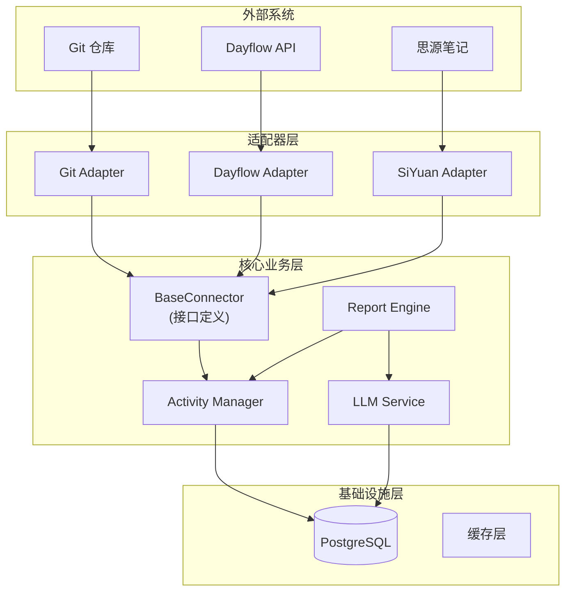
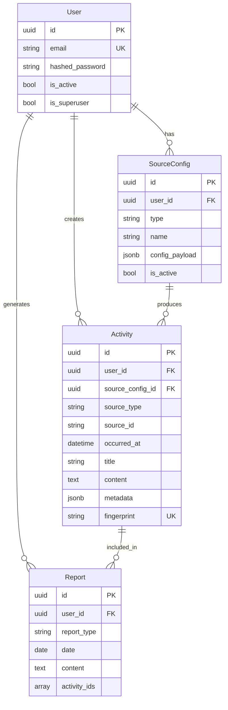
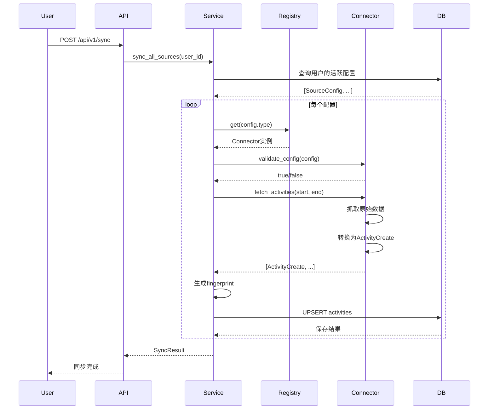
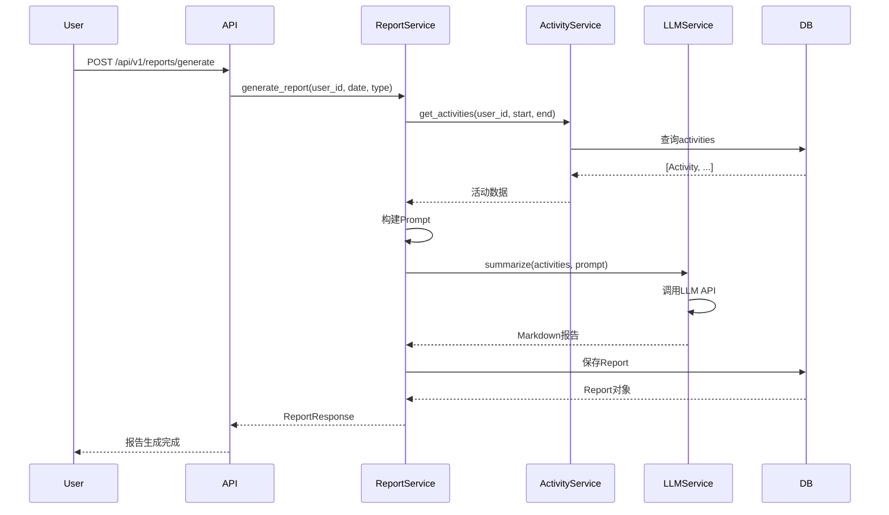
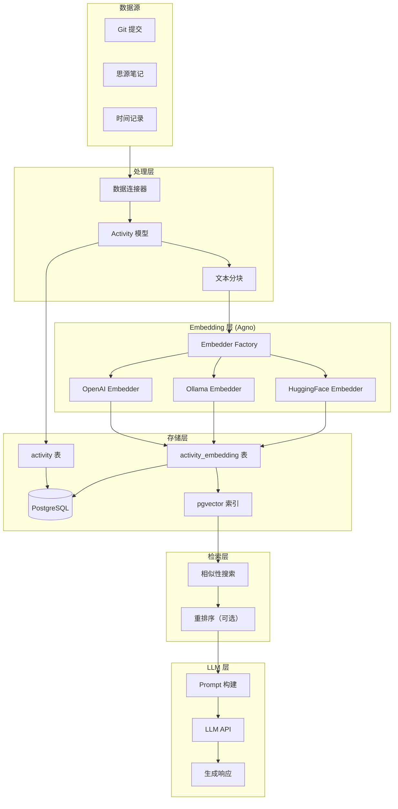
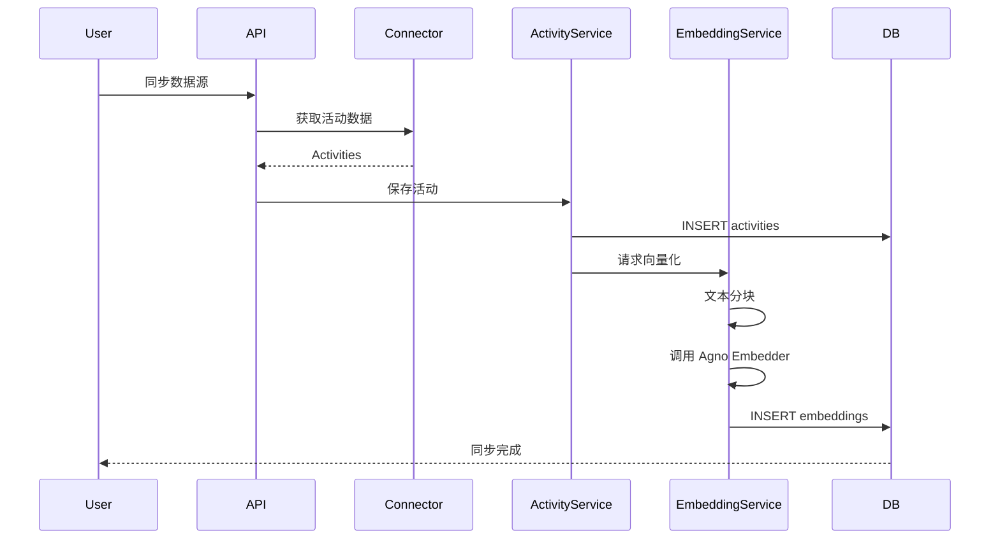
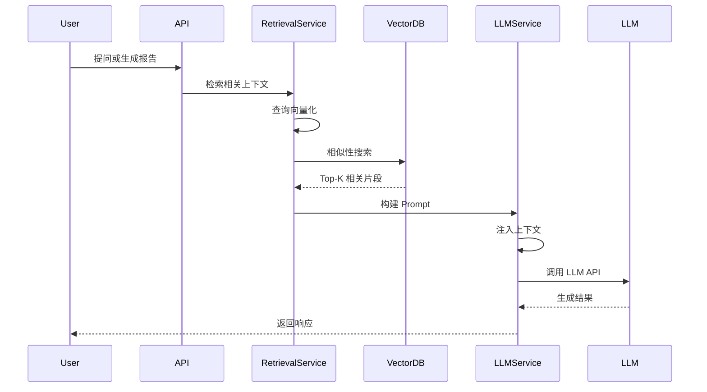

# TraceWeaver 架构设计文档

本文档详细说明 TraceWeaver 项目的系统架构、设计理念和实现细节。

## 目录

- [1. 架构概览](#1-架构概览)
- [2. 核心数据抽象](#2-核心数据抽象)
- [3. 后端工程结构](#3-后端工程结构)
- [4. 连接器接口设计](#4-连接器接口设计)
- [5. 数据库模型设计](#5-数据库模型设计)
- [6. 核心业务流程](#6-核心业务流程)
- [7. RAG 与向量存储](#7-rag-与向量存储)
- [8. 扩展指南](#8-扩展指南)

---

## 1. 架构概览

### 1.1 设计原则

TraceWeaver 采用 **Hexagonal Architecture（六边形架构）**，也称为 **Ports and Adapters Pattern（端口适配器模式）**。这种架构的核心思想是：

- **高内聚、低耦合**：核心业务逻辑与外部系统完全解耦
- **依赖倒置**：核心层定义接口，适配器层实现接口
- **可测试性**：核心逻辑可以独立测试，不依赖外部系统
- **可扩展性**：添加新数据源只需实现接口，无需修改核心代码

### 1.2 架构层次



### 1.3 数据流向

1. **数据采集**：适配器从外部系统获取原始数据
2. **数据转换**：适配器将原始数据转换为统一的活动模型
3. **数据存储**：Activity Manager 处理去重和存储
4. **报告生成**：Report Engine 聚合活动数据，调用 LLM 生成报告
5. **数据展示**：前端从 API 获取数据并展示

---

## 2. 核心数据抽象

### 2.1 统一活动模型 (Unified Activity Model)

为了实现解耦，我们不能在数据库里存储特定数据源的表（如 `GitCommit`、`DayflowTask`）。相反，我们使用一个通用的 `Activity` 模型来存储所有数据源的活动。

#### 2.1.1 数据模型定义

```python
class Activity(SQLModel, table=True):
    """统一活动模型 - 所有数据源的标准化表示"""
    
    id: uuid.UUID = Field(default_factory=uuid.uuid4, primary_key=True)
    user_id: uuid.UUID = Field(foreign_key="user.id", index=True)
    source_config_id: uuid.UUID = Field(foreign_key="source_config.id")
    
    # 核心字段
    source_type: str = Field(index=True)  # "git", "dayflow", "siyuan"
    source_id: str = Field(index=True)     # 来源方的唯一ID
    occurred_at: datetime = Field(index=True)  # 发生时间
    title: str                            # 简短描述
    content: str | None = None            # 详细内容/上下文
    
    # 扩展字段
    metadata: dict = Field(default_factory=dict, sa_column=Column(JSONB))
    
    # 去重字段
    fingerprint: str = Field(unique=True, index=True)  # 哈希指纹
    
    # 时间戳
    created_at: datetime = Field(default_factory=datetime.utcnow)
    updated_at: datetime = Field(default_factory=datetime.utcnow)
```

#### 2.1.2 字段说明

| 字段 | 类型 | 说明 | 示例 |
|------|------|------|------|
| `id` | UUID | 主键 | `550e8400-e29b-41d4-a716-446655440000` |
| `user_id` | UUID | 用户ID | - |
| `source_config_id` | UUID | 数据源配置ID | - |
| `source_type` | String | 数据源类型 | `"git"`, `"dayflow"`, `"siyuan"` |
| `source_id` | String | 来源方的唯一ID | Git Hash: `"a1b2c3d"` |
| `occurred_at` | DateTime | 发生时间 | `2023-10-27 14:30:00` |
| `title` | String | 简短描述 | `"fix: payment logic"` |
| `content` | Text | 详细内容 | Commit Diff 或笔记正文 |
| `metadata` | JSONB | 源特有数据 | `{"repo": "backend", "branch": "main"}` |
| `fingerprint` | String | 哈希指纹 | SHA256 哈希，用于去重 |

#### 2.1.3 元数据 (Metadata) 设计

`metadata` 字段使用 JSONB 类型存储数据源特有的信息，不同数据源的元数据结构不同：

**Git 数据源**:
```json
{
  "repo": "backend",
  "branch": "main",
  "author": "John Doe",
  "files_changed": 5,
  "insertions": 120,
  "deletions": 30
}
```

**Dayflow 数据源**:
```json
{
  "project": "Project A",
  "tags": ["work", "development"],
  "duration_minutes": 120
}
```

**SiYuan 数据源**:
```json
{
  "notebook": "工作笔记",
  "path": "/工作/2023/10月",
  "tags": ["会议", "总结"]
}
```

### 2.2 数据源配置模型 (Source Config)

用户可以为每个数据源配置连接信息：

```python
class SourceConfig(SQLModel, table=True):
    """数据源配置 - 存储用户的连接配置"""
    
    id: uuid.UUID = Field(default_factory=uuid.uuid4, primary_key=True)
    user_id: uuid.UUID = Field(foreign_key="user.id", index=True)
    
    # 配置信息
    type: str = Field(index=True)  # "git", "dayflow", "siyuan"
    name: str                      # 用户自定义名称
    config_payload: dict = Field(default_factory=dict, sa_column=Column(JSONB))
    
    # 状态
    is_active: bool = Field(default=True)
    
    # 时间戳
    created_at: datetime = Field(default_factory=datetime.utcnow)
    updated_at: datetime = Field(default_factory=datetime.utcnow)
```

**配置示例**:

Git 配置:
```json
{
  "repo_path": "/Users/leo/projects/backend",
  "branch": "main"
}
```

Dayflow 配置:
```json
{
  "api_token": "xxx",
  "api_url": "https://api.dayflow.com"
}
```

SiYuan 配置:
```json
{
  "api_url": "http://localhost:6806",
  "api_token": "xxx"
}
```

### 2.3 报告模型 (Report)

生成的报告存储在 `reports` 表中：

```python
class Report(SQLModel, table=True):
    """生成的报告"""
    
    id: uuid.UUID = Field(default_factory=uuid.uuid4, primary_key=True)
    user_id: uuid.UUID = Field(foreign_key="user.id", index=True)
    
    # 报告信息
    report_type: str = Field(index=True)  # "daily", "weekly"
    date: date = Field(index=True)         # 报告日期
    start_date: date | None = None         # 周报开始日期
    end_date: date | None = None           # 周报结束日期
    
    # 内容
    content: str                           # Markdown 格式的报告内容
    content_edited: str | None = None      # 用户编辑后的内容
    
    # 关联的活动
    activity_ids: list[uuid.UUID] = Field(default_factory=list, sa_column=Column(ARRAY(UUID)))
    
    # 时间戳
    created_at: datetime = Field(default_factory=datetime.utcnow)
    updated_at: datetime = Field(default_factory=datetime.utcnow)
```

---

## 3. 后端工程结构

### 3.1 目录结构

```
backend/
├── app/
│   ├── api/                    # API 路由层
│   │   ├── v1/
│   │   │   └── endpoints/
│   │   │       ├── sources.py      # 数据源配置管理
│   │   │       ├── activities.py   # 活动数据查询
│   │   │       ├── sync.py        # 同步接口
│   │   │       └── reports.py     # 报告生成和查询
│   │   ├── deps.py            # 依赖注入（认证等）
│   │   └── main.py            # API 路由注册
│   │
│   ├── core/                  # 核心配置
│   │   ├── config.py          # 环境变量配置
│   │   ├── db.py              # 数据库连接
│   │   └── security.py        # 安全相关（JWT、密码等）
│   │
│   ├── models/                # SQLModel ORM 模型
│   │   ├── base.py            # 基础模型类
│   │   ├── user.py            # 用户模型
│   │   ├── source_config.py   # 数据源配置模型
│   │   ├── activity.py        # 活动模型
│   │   └── report.py          # 报告模型
│   │
│   ├── schemas/               # Pydantic 模型 (DTOs)
│   │   ├── user.py
│   │   ├── source_config.py
│   │   ├── activity.py
│   │   └── report.py
│   │
│   ├── services/              # 业务逻辑层
│   │   ├── activity_service.py    # 活动管理服务
│   │   ├── report_service.py      # 报告生成服务
│   │   └── llm_service.py        # LLM 调用服务
│   │
│   ├── connectors/            # === 核心解耦层 ===
│   │   ├── base.py            # BaseConnector 抽象基类
│   │   ├── registry.py        # 连接器注册工厂
│   │   └── impl/              # 具体实现
│   │       ├── git_connector.py
│   │       ├── dayflow_connector.py
│   │       └── siyuan_connector.py
│   │
│   ├── crud.py                # CRUD 工具函数
│   └── utils.py              # 工具函数
│
├── alembic/                   # 数据库迁移
│   └── versions/
│
└── tests/                     # 测试代码
    ├── api/
    ├── services/
    └── connectors/
```

### 3.2 模块职责

#### 3.2.1 API 层 (`app/api/`)

- **职责**：处理 HTTP 请求和响应
- **特点**：薄层，只负责参数验证和调用服务层
- **示例**：

```python
@router.post("/sync", response_model=SyncResponse)
async def sync_activities(
    current_user: User = Depends(get_current_active_user),
    db: Session = Depends(get_db),
) -> SyncResponse:
    """同步所有配置的数据源"""
    service = ActivityService(db)
    result = await service.sync_all_sources(user_id=current_user.id)
    return SyncResponse(**result)
```

#### 3.2.2 服务层 (`app/services/`)

- **职责**：实现核心业务逻辑
- **特点**：无状态，可测试，不直接依赖外部系统
- **示例**：

```python
class ActivityService:
    def __init__(self, db: Session):
        self.db = db
        self.connector_registry = ConnectorRegistry()
    
    async def sync_all_sources(self, user_id: UUID) -> dict:
        """同步用户所有配置的数据源"""
        configs = self.get_active_configs(user_id)
        results = []
        
        for config in configs:
            connector = self.connector_registry.get(config.type)
            activities = await connector.fetch_activities(
                config.config_payload,
                start_time=...,
                end_time=...
            )
            # 去重和存储
            saved = self.upsert_activities(user_id, config.id, activities)
            results.append(saved)
        
        return {"total": sum(results)}
```

#### 3.2.3 适配器层 (`app/connectors/`)

- **职责**：与外部系统交互，数据转换
- **特点**：实现统一接口，可插拔
- **位置**：这是实现解耦的关键层

---

## 4. 连接器接口设计

### 4.1 抽象基类定义

所有数据源连接器必须实现 `BaseConnector` 接口：

```python
from abc import ABC, abstractmethod
from typing import List
from datetime import datetime
from app.schemas.activity import ActivityCreate

class BaseConnector(ABC):
    """所有数据源必须实现的接口"""
    
    @property
    @abstractmethod
    def source_type(self) -> str:
        """返回数据源类型标识"""
        pass
    
    @abstractmethod
    async def validate_config(self, config: dict) -> bool:
        """
        验证配置是否有效
        
        Args:
            config: 数据源配置字典
            
        Returns:
            bool: 配置是否有效
            
        Raises:
            ValueError: 配置格式错误
            ConnectionError: 无法连接到数据源
        """
        pass
    
    @abstractmethod
    async def fetch_activities(
        self,
        config: dict,
        start_time: datetime,
        end_time: datetime,
    ) -> List[ActivityCreate]:
        """
        抓取指定时间范围内的活动数据
        
        Args:
            config: 数据源配置字典
            start_time: 开始时间
            end_time: 结束时间
            
        Returns:
            List[ActivityCreate]: 活动对象列表
            
        Raises:
            ValueError: 配置错误
            ConnectionError: 连接失败
        """
        pass
    
    def generate_fingerprint(
        self,
        source_type: str,
        source_id: str,
        occurred_at: datetime,
    ) -> str:
        """
        生成活动指纹，用于去重
        
        Args:
            source_type: 数据源类型
            source_id: 来源ID
            occurred_at: 发生时间
            
        Returns:
            str: SHA256 哈希值
        """
        import hashlib
        content = f"{source_type}:{source_id}:{occurred_at.isoformat()}"
        return hashlib.sha256(content.encode()).hexdigest()
```

### 4.2 Git 连接器实现示例

```python
from git import Repo
from app.connectors.base import BaseConnector
from app.schemas.activity import ActivityCreate

class GitConnector(BaseConnector):
    """Git 数据源连接器"""
    
    @property
    def source_type(self) -> str:
        return "git"
    
    async def validate_config(self, config: dict) -> bool:
        """验证 Git 仓库路径是否存在"""
        repo_path = config.get("repo_path")
        if not repo_path:
            raise ValueError("repo_path is required")
        
        try:
            Repo(repo_path)
            return True
        except Exception as e:
            raise ConnectionError(f"Invalid git repository: {e}")
    
    async def fetch_activities(
        self,
        config: dict,
        start_time: datetime,
        end_time: datetime,
    ) -> List[ActivityCreate]:
        """从 Git 仓库读取提交记录"""
        repo_path = config["repo_path"]
        branch = config.get("branch", "main")
        
        repo = Repo(repo_path)
        repo.git.checkout(branch)
        
        activities = []
        for commit in repo.iter_commits(
            rev=branch,
            since=start_time,
            until=end_time,
        ):
            # 转换为统一活动模型
            activity = ActivityCreate(
                source_type="git",
                source_id=commit.hexsha,
                occurred_at=commit.authored_datetime,
                title=commit.message.split("\n")[0],  # 第一行作为标题
                content=commit.message,
                metadata={
                    "repo": repo_path.split("/")[-1],
                    "branch": branch,
                    "author": commit.author.name,
                    "email": commit.author.email,
                    "files_changed": len(commit.stats.files),
                    "insertions": commit.stats.total["insertions"],
                    "deletions": commit.stats.total["deletions"],
                },
                fingerprint=self.generate_fingerprint(
                    "git",
                    commit.hexsha,
                    commit.authored_datetime,
                ),
            )
            activities.append(activity)
        
        return activities
```

### 4.3 连接器注册机制

使用工厂模式管理连接器：

```python
class ConnectorRegistry:
    """连接器注册表 - 工厂模式"""
    
    def __init__(self):
        self._connectors: dict[str, type[BaseConnector]] = {}
    
    def register(self, source_type: str, connector_class: type[BaseConnector]):
        """注册连接器"""
        self._connectors[source_type] = connector_class
    
    def get(self, source_type: str) -> BaseConnector:
        """获取连接器实例"""
        if source_type not in self._connectors:
            raise ValueError(f"Unknown connector type: {source_type}")
        return self._connectors[source_type]()
    
    def list_types(self) -> List[str]:
        """列出所有已注册的连接器类型"""
        return list(self._connectors.keys())

# 全局注册表实例
registry = ConnectorRegistry()

# 自动注册所有连接器
registry.register("git", GitConnector)
registry.register("dayflow", DayflowConnector)
registry.register("siyuan", SiYuanConnector)
```

---

## 5. 数据库模型设计

### 5.1 实体关系图



### 5.2 索引设计

为了提高查询性能，需要在关键字段上创建索引：

- `activities.user_id` + `activities.occurred_at` - 复合索引，用于查询用户的时间范围活动
- `activities.source_type` + `activities.source_id` - 复合索引，用于去重检查
- `activities.fingerprint` - 唯一索引，用于去重
- `reports.user_id` + `reports.date` - 复合索引，用于查询用户报告

---

## 6. 核心业务流程

### 6.1 同步流程 (Sync)



### 6.2 报告生成流程 (Generate)



### 6.3 Prompt 工程

报告生成的 Prompt 设计：

**System Prompt**:
```
你是一个技术专家助手，擅长将开发者的工作痕迹整理成清晰的工作日志。
请基于提供的活动数据，生成一份专业、简洁的工作日报/周报。
```

**User Prompt 模板**:
```
基于以下活动数据，生成一份{report_type}工作报告：

## Git 提交记录
{git_activities_json}

## 时间记录
{dayflow_activities_json}

## 笔记内容
{siyuan_activities_json}

要求：
1. 按时间顺序组织内容
2. 突出重要工作成果
3. 使用 Markdown 格式
4. 保持简洁专业
```

---

## 7. RAG 与向量存储

### 7.1 设计目标

TraceWeaver 不仅是活动记录系统，更是个人知识库。通过 RAG（Retrieval-Augmented Generation）技术，我们可以：

- **语义搜索**：根据意图而非关键词查找活动和笔记
- **智能问答**：基于个人数据回答问题
- **上下文增强**：为 LLM 提供相关历史信息，生成更准确的报告

### 7.2 技术选型

#### 7.2.1 向量数据库

使用 **PostgreSQL + pgvector** 扩展，而非独立向量数据库：

**优势：**
- 统一存储：业务数据和向量数据在同一数据库
- 简化部署：无需额外维护向量数据库
- 事务一致性：向量和原始数据更新保持一致
- 成熟稳定：PostgreSQL 的高可用和备份方案

**启用 pgvector：**
```sql
CREATE EXTENSION vector;
```

#### 7.2.2 Embedding 框架

使用 **[Agno 框架](https://docs.agno.com/basics/knowledge/embedder/overview)** 的 Embedder 抽象层：

**优势：**
- 统一接口：支持多种 Embedder 后端
- 灵活切换：开发环境用本地模型，生产环境用云端 API
- 可扩展：轻松添加新的 Embedding 提供商

**支持的 Embedder：**
- **OpenAI** - `text-embedding-3-small/large`（云端，高质量）
- **Ollama** - 本地运行开源模型（隐私保护，无 API 费用）
- **HuggingFace** - 开源模型（自托管或云端）
- **Gemini** - Google 云端服务
- **Cohere** - 专业 Embedding 服务

### 7.3 系统架构



### 7.4 数据模型设计

#### 7.4.1 活动向量表

```python
from typing import Optional, List
from sqlmodel import Field, SQLModel, Column
from sqlalchemy import Index
from pgvector.sqlalchemy import Vector

class ActivityEmbedding(SQLModel, table=True):
    """活动向量表 - 存储文本分块的向量表示"""
    
    __tablename__ = "activity_embedding"
    
    # 主键
    id: Optional[int] = Field(default=None, primary_key=True)
    
    # 虚拟外键（无数据库约束）
    activity_id: int = Field(index=True)
    user_id: str = Field(index=True)  # 用于数据隔离
    
    # 向量字段
    embedding: List[float] = Field(sa_column=Column(Vector(1536)))
    
    # 文本分块
    chunk_text: str  # 原始文本片段
    chunk_index: int  # 片段在完整文本中的索引
    
    # 元数据
    embedder_model: str  # 使用的模型名称（用于重新向量化）
    embedder_provider: str  # 提供商（openai/ollama/huggingface）
    
    # 时间戳
    created_at: datetime = Field(default_factory=datetime.now)
    
    __table_args__ = (
        # 向量相似性搜索索引（使用 HNSW 算法）
        Index(
            "idx_embedding_vector",
            "embedding",
            postgresql_using="hnsw",
            postgresql_with={"m": 16, "ef_construction": 64},
            postgresql_ops={"embedding": "vector_cosine_ops"},
        ),
        # 用户隔离索引
        Index("idx_embedding_user_activity", "user_id", "activity_id"),
    )
```

#### 7.4.2 Embedder 配置模型

```python
from pydantic import BaseModel
from typing import Literal, Optional

class EmbedderConfig(BaseModel):
    """Embedder 配置 - 存储在系统配置或用户设置中"""
    
    provider: Literal["openai", "ollama", "huggingface", "gemini", "cohere"]
    model_name: str  # 例如: "text-embedding-3-small", "nomic-embed-text"
    dimensions: int = 1536  # 向量维度
    
    # API 配置（云端模型）
    api_key: Optional[str] = None
    api_base: Optional[str] = None
    
    # 本地模型配置（Ollama）
    base_url: Optional[str] = "http://localhost:11434"  # Ollama 默认地址
    
    # 性能配置
    batch_size: int = 100  # 批量处理大小
    enable_batch: bool = True  # 是否启用批量处理
```

### 7.5 核心业务流程

#### 7.5.1 数据同步与向量化



#### 7.5.2 RAG 查询流程



### 7.6 Embedder 集成实现

#### 7.6.1 Embedder 工厂

```python
from agno.knowledge.embedder.openai import OpenAIEmbedder
from agno.knowledge.embedder.ollama import OllamaEmbedder
from agno.knowledge.embedder.huggingface import HuggingFaceEmbedder

class EmbedderFactory:
    """Embedder 工厂 - 根据配置创建 Embedder 实例"""
    
    @staticmethod
    def create(config: EmbedderConfig):
        """根据配置创建 Embedder
        
        Args:
            config: Embedder 配置
            
        Returns:
            Agno Embedder 实例
        """
        if config.provider == "openai":
            return OpenAIEmbedder(
                id=config.model_name,
                dimensions=config.dimensions,
                api_key=config.api_key,
                enable_batch=config.enable_batch,
                batch_size=config.batch_size,
            )
        elif config.provider == "ollama":
            return OllamaEmbedder(
                id=config.model_name,
                dimensions=config.dimensions,
                host=config.base_url,
            )
        elif config.provider == "huggingface":
            return HuggingFaceEmbedder(
                id=config.model_name,
                api_key=config.api_key,
            )
        else:
            raise ValueError(f"Unsupported provider: {config.provider}")
```

#### 7.6.2 Embedding 服务

```python
from typing import List
from loguru import logger

class EmbeddingService:
    """Embedding 服务 - 处理文本向量化"""
    
    def __init__(self, embedder_config: EmbedderConfig):
        self.embedder = EmbedderFactory.create(embedder_config)
        self.config = embedder_config
    
    def chunk_text(self, text: str, chunk_size: int = 512, overlap: int = 50) -> List[str]:
        """将长文本分块
        
        Args:
            text: 原始文本
            chunk_size: 块大小（字符数）
            overlap: 重叠大小
            
        Returns:
            文本块列表
        """
        if len(text) <= chunk_size:
            return [text]
        
        chunks = []
        start = 0
        while start < len(text):
            end = start + chunk_size
            chunk = text[start:end]
            chunks.append(chunk)
            start += chunk_size - overlap
        
        return chunks
    
    def embed_activity(self, activity: Activity, db: Session) -> List[ActivityEmbedding]:
        """为活动生成向量
        
        Args:
            activity: 活动对象
            db: 数据库 Session
            
        Returns:
            生成的向量记录列表
        """
        # 构建待向量化的文本
        text = f"{activity.title}\n\n{activity.content or ''}"
        
        # 文本分块
        chunks = self.chunk_text(text)
        logger.info(f"Activity {activity.id} split into {len(chunks)} chunks")
        
        # 批量向量化
        embeddings_list = self.embedder.get_embeddings(chunks)
        
        # 创建向量记录
        embedding_records = []
        for idx, (chunk, embedding) in enumerate(zip(chunks, embeddings_list)):
            record = ActivityEmbedding(
                activity_id=activity.id,
                user_id=activity.user_id,
                embedding=embedding,
                chunk_text=chunk,
                chunk_index=idx,
                embedder_model=self.config.model_name,
                embedder_provider=self.config.provider,
            )
            embedding_records.append(record)
            db.add(record)
        
        db.commit()
        logger.info(f"Created {len(embedding_records)} embeddings for activity {activity.id}")
        return embedding_records
```

#### 7.6.3 检索服务

```python
from sqlalchemy import text, select

class RetrievalService:
    """检索服务 - 执行向量相似性搜索"""
    
    def __init__(self, embedder_config: EmbedderConfig):
        self.embedder = EmbedderFactory.create(embedder_config)
    
    def search(
        self,
        query: str,
        user_id: str,
        db: Session,
        top_k: int = 5,
        min_similarity: float = 0.7,
    ) -> List[tuple[ActivityEmbedding, float]]:
        """语义搜索
        
        Args:
            query: 查询文本
            user_id: 用户 ID（数据隔离）
            db: 数据库 Session
            top_k: 返回结果数量
            min_similarity: 最小相似度阈值
            
        Returns:
            (向量记录, 相似度分数) 元组列表
        """
        # 查询向量化
        query_embedding = self.embedder.get_embedding(query)
        
        # 向量相似性搜索（使用余弦相似度）
        sql = text("""
            SELECT 
                id,
                activity_id,
                chunk_text,
                1 - (embedding <=> :query_embedding) AS similarity
            FROM activity_embedding
            WHERE user_id = :user_id
            AND 1 - (embedding <=> :query_embedding) > :min_similarity
            ORDER BY embedding <=> :query_embedding
            LIMIT :top_k
        """)
        
        results = db.execute(
            sql,
            {
                "query_embedding": query_embedding,
                "user_id": user_id,
                "min_similarity": min_similarity,
                "top_k": top_k,
            }
        ).fetchall()
        
        return results
```

### 7.7 Git 批量扫描设计

为了自动发现 `~/work` 下的所有 Git 仓库，我们支持两种模式：

#### 7.7.1 手动配置模式（现有）

用户在前端逐个添加 Git 仓库配置：

```python
# 用户创建的配置
SourceConfig(
    type=SourceType.GIT,
    name="Backend Repo",
    config_payload={
        "repo_path": "/Users/leo/work/backend",
        "branch": "main"
    }
)
```

#### 7.7.2 批量扫描模式（新增）

新增 Git 扫描配置模型：

```python
class GitScanConfig(SQLModel, table=True):
    """Git 批量扫描配置"""
    
    __tablename__ = "git_scan_config"
    
    id: Optional[int] = Field(default=None, primary_key=True)
    user_id: str = Field(index=True)
    
    # 扫描配置
    scan_root_path: str  # 扫描根目录，如 "/Users/leo/work"
    include_patterns: List[str] = Field(default_factory=lambda: ["*"])  # 包含模式
    exclude_patterns: List[str] = Field(
        default_factory=lambda: ["node_modules", ".git", "venv", "__pycache__"]
    )
    
    # 状态
    is_active: bool = Field(default=True)
    last_scan_at: Optional[datetime] = None
    
    # 时间戳
    created_at: datetime = Field(default_factory=datetime.now)
    updated_at: datetime = Field(default_factory=datetime.now)
```

#### 7.7.3 扫描服务

```python
import os
from pathlib import Path
from git import Repo, InvalidGitRepositoryError

class GitScanService:
    """Git 仓库扫描服务"""
    
    def scan_directory(self, scan_config: GitScanConfig) -> List[dict]:
        """扫描目录下的所有 Git 仓库
        
        Args:
            scan_config: 扫描配置
            
        Returns:
            发现的仓库信息列表
        """
        root_path = Path(scan_config.scan_root_path).expanduser()
        discovered_repos = []
        
        for item in root_path.rglob("*"):
            # 跳过排除的目录
            if any(pattern in str(item) for pattern in scan_config.exclude_patterns):
                continue
            
            # 检查是否是 Git 仓库
            if item.is_dir() and (item / ".git").exists():
                try:
                    repo = Repo(item)
                    discovered_repos.append({
                        "path": str(item),
                        "name": item.name,
                        "branch": repo.active_branch.name,
                        "remote_url": repo.remotes.origin.url if repo.remotes else None,
                    })
                except InvalidGitRepositoryError:
                    continue
        
        return discovered_repos
    
    def auto_create_configs(
        self,
        scan_config: GitScanConfig,
        db: Session,
    ) -> List[SourceConfig]:
        """自动为发现的仓库创建配置
        
        Args:
            scan_config: 扫描配置
            db: 数据库 Session
            
        Returns:
            创建的配置列表
        """
        repos = self.scan_directory(scan_config)
        created_configs = []
        
        for repo_info in repos:
            # 检查是否已存在配置
            existing = db.exec(
                select(SourceConfig).where(
                    SourceConfig.user_id == scan_config.user_id,
                    SourceConfig.type == SourceType.GIT,
                    SourceConfig.config_payload["repo_path"].as_string() == repo_info["path"]
                )
            ).first()
            
            if not existing:
                config = SourceConfig(
                    user_id=scan_config.user_id,
                    type=SourceType.GIT,
                    name=f"{repo_info['name']} (auto)",
                    config_payload={
                        "repo_path": repo_info["path"],
                        "branch": repo_info["branch"],
                    },
                    is_active=True,
                )
                db.add(config)
                created_configs.append(config)
        
        db.commit()
        
        # 更新扫描时间
        scan_config.last_scan_at = datetime.now()
        db.add(scan_config)
        db.commit()
        
        logger.info(f"Created {len(created_configs)} new Git configs from scan")
        return created_configs
```

### 7.8 性能优化建议

#### 7.8.1 向量化优化

- **批量处理**：使用 Agno 的 `enable_batch=True` 批量向量化
- **异步处理**：大批量数据使用 Celery 异步任务
- **增量更新**：只向量化新增或修改的活动

#### 7.8.2 检索优化

- **HNSW 索引**：使用 pgvector 的 HNSW 索引加速搜索
- **结果缓存**：相同查询缓存结果（Redis）
- **过滤前置**：先用元数据过滤，再进行向量搜索

#### 7.8.3 存储优化

- **向量压缩**：使用较小维度的模型（如 384 维）
- **分区表**：按用户或时间分区 embedding 表
- **定期清理**：删除旧模型的向量数据

### 7.9 模型切换策略

当更换 Embedder 模型时，需要重新向量化所有数据：

```python
class EmbeddingMigrationService:
    """Embedder 迁移服务"""
    
    def migrate_embeddings(
        self,
        old_model: str,
        new_config: EmbedderConfig,
        db: Session,
    ):
        """迁移到新的 Embedder
        
        Args:
            old_model: 旧模型名称
            new_config: 新模型配置
            db: 数据库 Session
        """
        # 1. 删除旧向量
        db.exec(
            delete(ActivityEmbedding).where(
                ActivityEmbedding.embedder_model == old_model
            )
        )
        db.commit()
        
        # 2. 获取所有活动
        activities = db.exec(select(Activity)).all()
        
        # 3. 使用新模型重新向量化
        embedding_service = EmbeddingService(new_config)
        for activity in activities:
            embedding_service.embed_activity(activity, db)
```

---

## 8. 扩展指南

### 8.1 添加新的数据源

要添加新的数据源（例如 Jira），只需以下步骤：

#### 步骤 1: 创建连接器类

在 `backend/app/connectors/impl/jira_connector.py`:

```python
from app.connectors.base import BaseConnector
from app.schemas.activity import ActivityCreate

class JiraConnector(BaseConnector):
    @property
    def source_type(self) -> str:
        return "jira"
    
    async def validate_config(self, config: dict) -> bool:
        # 验证 Jira API Token 和 URL
        api_url = config.get("api_url")
        api_token = config.get("api_token")
        # ... 验证逻辑
        return True
    
    async def fetch_activities(
        self,
        config: dict,
        start_time: datetime,
        end_time: datetime,
    ) -> List[ActivityCreate]:
        # 调用 Jira API 获取 issues
        # 转换为 ActivityCreate 对象
        activities = []
        # ... 转换逻辑
        return activities
```

#### 步骤 2: 注册连接器

在 `backend/app/connectors/registry.py`:

```python
from app.connectors.impl.jira_connector import JiraConnector

registry.register("jira", JiraConnector)
```

#### 步骤 3: 更新前端配置表单

在 `frontend/src/components/Connectors/` 添加 `JiraConfigForm.tsx`。

### 8.2 自定义报告模板

可以通过修改 `ReportService` 中的 Prompt 模板来自定义报告格式：

```python
class ReportService:
    def _build_prompt(self, activities: List[Activity], report_type: str) -> str:
        # 自定义 Prompt 模板
        template = """
        请生成一份{type}报告，包含以下内容：
        1. 工作概述
        2. 主要成果
        3. 遇到的问题
        4. 下周计划
        """
        # ... 填充数据
        return prompt
```

### 8.3 添加新的报告类型

1. 在 `Report` 模型中添加新的 `report_type` 值
2. 在 `ReportService` 中添加生成逻辑
3. 在前端添加对应的 UI

---

## 8. 性能优化建议

### 8.1 数据同步优化

- **增量同步**：只同步上次同步后的新数据
- **并发同步**：使用 `asyncio.gather` 并发同步多个数据源
- **缓存机制**：缓存数据源配置，避免重复验证

### 8.2 查询优化

- **分页查询**：活动列表使用分页，避免一次性加载大量数据
- **时间范围索引**：在 `occurred_at` 字段上创建索引
- **JSONB 查询**：利用 PostgreSQL 的 JSONB 索引功能

### 8.3 LLM 调用优化

- **批量处理**：将多个活动合并到一个 Prompt 中
- **缓存结果**：相同输入缓存 LLM 结果
- **流式输出**：使用流式 API 提升用户体验

---

## 9. 安全考虑

### 9.1 数据隔离

- 所有查询都基于 `user_id` 进行过滤
- 使用数据库行级安全策略（如果支持）

### 9.2 配置安全

- 敏感配置（如 API Token）加密存储
- 使用环境变量管理密钥

### 9.3 API 安全

- JWT 认证保护所有 API 端点
- 输入验证防止 SQL 注入和 XSS
- 速率限制防止滥用

---

## 10. 测试策略

### 10.1 单元测试

- **连接器测试**：Mock 外部 API，测试数据转换逻辑
- **服务层测试**：测试业务逻辑，不依赖数据库
- **工具函数测试**：测试辅助函数

### 10.2 集成测试

- **API 测试**：测试完整的请求-响应流程
- **数据库测试**：使用测试数据库，测试数据持久化

### 10.3 E2E 测试

- **前端测试**：使用 Playwright 测试用户流程
- **同步流程测试**：测试完整的数据同步流程

---

## 总结

TraceWeaver 的架构设计遵循"高内聚、低耦合"的原则，通过适配器模式实现了核心业务逻辑与外部系统的完全解耦。这种设计使得：

1. **易于扩展**：添加新数据源只需实现接口
2. **易于测试**：核心逻辑可以独立测试
3. **易于维护**：清晰的层次结构，职责分明
4. **易于理解**：统一的抽象模型，降低认知负担

通过这种架构，TraceWeaver 可以轻松接入 Jira、Google Calendar、飞书等新的数据源，而无需重写核心业务逻辑。

